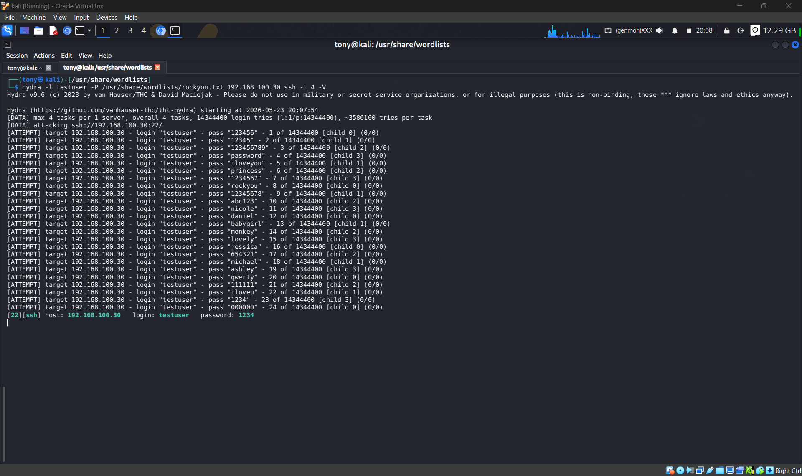
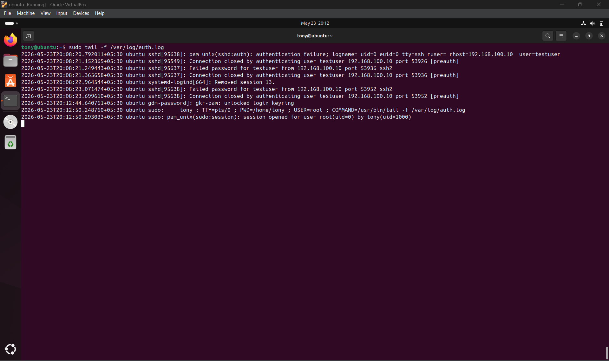
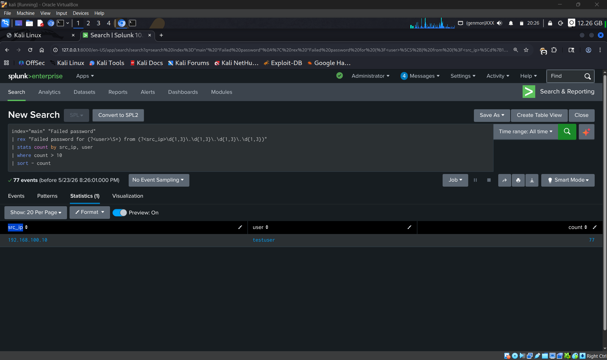
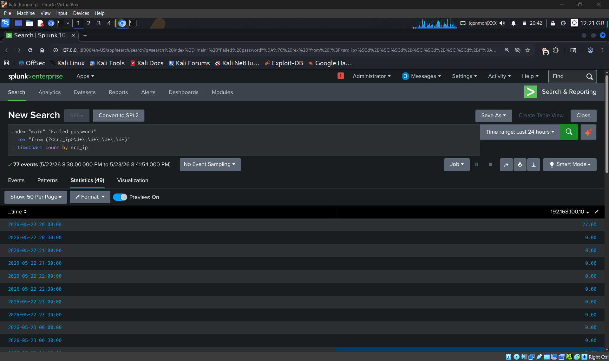
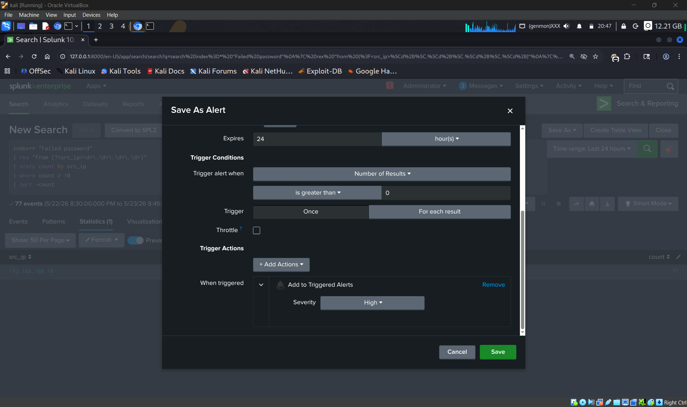
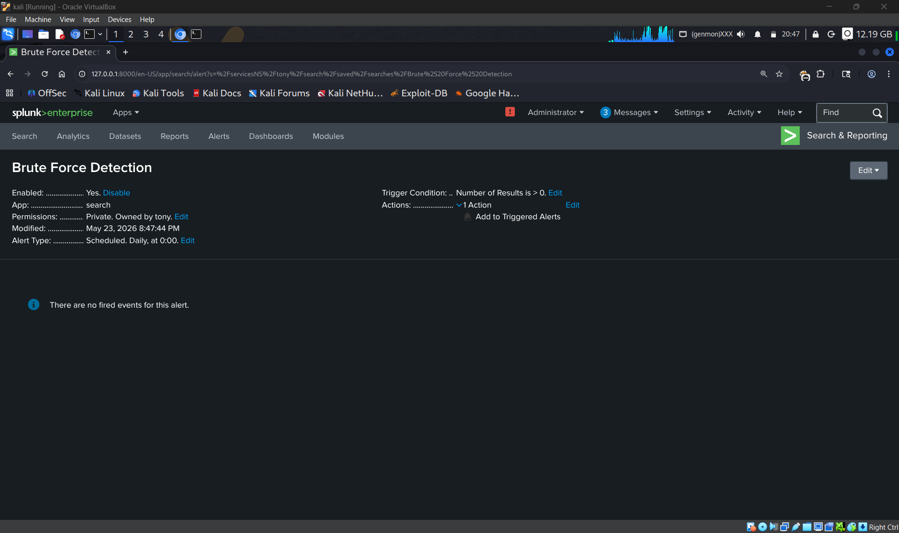

# 🔐 SOC Detection Lab – Brute Force Attack Detection


> A hands-on Security Operations Center (SOC) lab for simulating and detecting SSH brute-force attacks using Splunk SIEM on Kali Linux.

---

## 📋 Table of Contents
- [Project Overview](#-project-overview)
- [Architecture](#️-architecture)
- [Tools Used](#️-tools-used)
- [Installation](Installation.md)
- [Detection Queries](Detection.md)
- [MITRE ATT&CK Mapping](#-mitre-attck-mapping)
- [Key Results](#-key-results)
- [Screenshots](#-Screenshots)
- [Disclaimer](#️-disclaimer)

## 📸 Screenshots

## 📸 Project Screenshots

### 1. Hydra SSH Brute Force Attack


---

### 2. Failed SSH Login Logs


---

### 3. Splunk Detection Query Results


---

### 4. Splunk Dashboard Visualization


---

### 5. Alert Configuration


---

### 6. Triggered Alert


---

## 🎯 Project Overview

This project demonstrates:

- **SIEM Implementation** – Splunk Enterprise deployed on Kali Linux to collect and analyze authentication logs
- **Attack Simulation** – SSH brute-force attack simulated using Hydra against an Ubuntu target VM
- **Detection Engineering** – SPL (Splunk Processing Language) queries written to detect suspicious login patterns
- **Alert Configuration** – Automated alert rules configured to trigger on brute-force activity
- **MITRE ATT&CK Mapping** – Attack mapped to Technique T1110 (Brute Force)

---

## 🏗️ Architecture

```
┌─────────────────────────────────────────┐
│           SOC Detection Lab             │
├─────────────────────────────────────────┤
│   Kali Linux (Splunk + Attack Tools)    │
│  ┌────────────────────────────────────┐ │
│  │        Splunk Enterprise           │ │
│  │  ├── Log Ingestion (port 9997)     │ │
│  │  ├── SPL Detection Queries         │ │
│  │  ├── Alert Rules                   │ │
│  │  └── Dashboards                    │ │
│  └────────────────────────────────────┘ │
│                   ▲                     │
│                   │ Auth Logs           │
│                   │                     │
│  ┌────────────────────────────────────┐ │
│  │     Attack Simulation              │ │
│  │  └── Hydra (SSH Brute Force)       │ │
│  └────────────────────────────────────┘ │
├─────────────────────────────────────────┤
│     Target: Ubuntu VM (SSH Server)      │
│  ┌────────────────────────────────────┐ │
│  │    Vulnerable Users & Services     │ │
│  │  ├── SSH (port 22)                 │ │
│  │  ├── Weak Credentials              │ │
│  │  └── Auth Log Forwarding           │ │
│  └────────────────────────────────────┘ │
└─────────────────────────────────────────┘
```

---

## 🛠️ Tools Used

| Tool | Version | Purpose |
|------|---------|---------|
| Splunk Enterprise | 9.2.0 | SIEM – Log collection & threat detection |
| Kali Linux | 2024.1 | Attacker machine |
| Hydra | 9.4 | SSH brute-force attack simulation |
| Ubuntu Server | 22.04 LTS | Target victim machine |
| VirtualBox | 7.0 | Virtualization platform |

---

## 🎯 MITRE ATT&CK Mapping

| Field | Details |
|-------|---------|
| Tactic | TA0006 – Credential Access |
| Technique | T1110 – Brute Force |
| Sub-technique | T1110.001 – Password Guessing |
| Tool Used | Hydra |
| Target Service | SSH (port 22) |
| Log Source | /var/log/auth.log |
| Reference | https://attack.mitre.org/techniques/T1110 |

---

## 📊 Key Results

| Metric | Value |
|--------|-------|
| Attack tool | Hydra |
| Login attempts generated | 500+ per minute |
| Detection threshold | 10 failed attempts / minute from single IP |
| Time to alert | Within 5 minutes |
| Log source monitored | /var/log/auth.log |
| Technique detected | T1110.001 – Password Guessing |

---

## ⚡ Quick Start

```bash
# Step 1 – Install Splunk on Kali Linux
sudo dpkg -i splunk-9.2.0-amd64.deb
sudo /opt/splunk/bin/splunk start --accept-license

# Step 2 – Launch brute-force attack from Kali
hydra -l testuser -P /usr/share/wordlists/rockyou.txt <UBUNTU_IP> ssh -t 4 -V

# Step 3 – Detect attack in Splunk (SPL query)
index=main "Failed password"
| rex "from (?<src_ip>\d+\.\d+\.\d+\.\d+)"
| stats count by src_ip
| where count > 10
```

> Full setup guide → [Installation.md](Installation.md)

---


## ⚠️ Disclaimer

> This project is strictly for **educational purposes only**.
> All attacks were performed inside an **isolated virtual lab environment**.
> Never use these tools or techniques against systems you do not own or have explicit written permission to test.

---

## 👤 Author

**Thiru** – [GitHub](https://github.com/thiru011)
